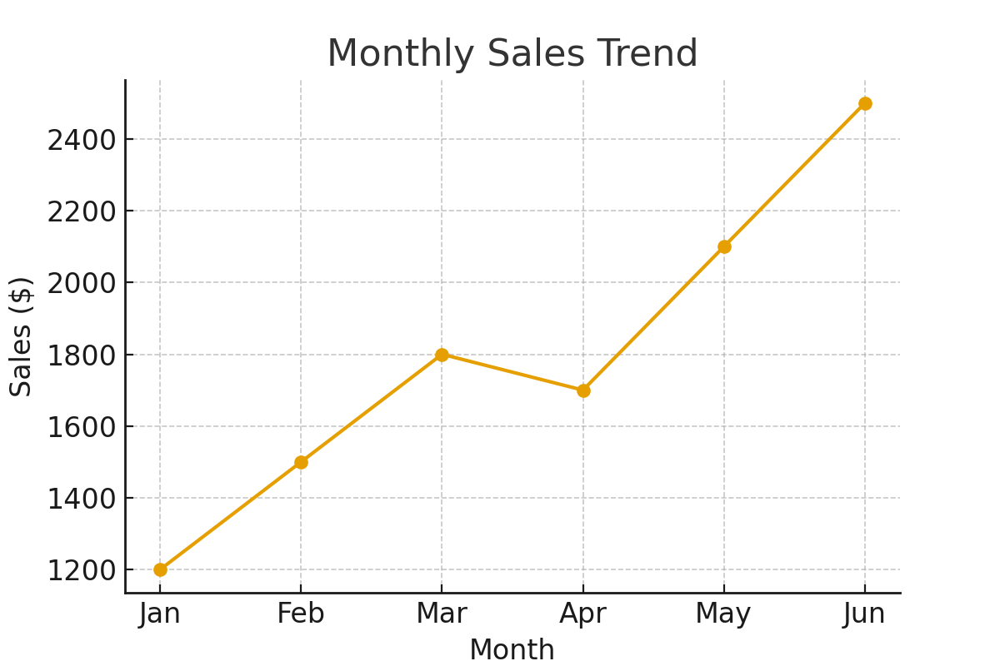

# Data Analytics Portfolio  

Self-developed SQL training document, sample dashboards, and Python-based analytics tools.  

---

## SQL Training Document  

This repository contains a self-developed **SQL Training Document**.  
It covers SQL fundamentals, queries, joins, functions, stored procedures, triggers, views, and integration with Visual Studio.  

📄 Files:  
- `SQL_Training_Document.pdf` → Full training material  

---

## 📊 A/B Test Analyzer (Python)  

This project showcases a single-file Python tool for running robust A/B test analysis.  
It demonstrates skills in **Python, Pandas, statistical testing, and reporting**.

### Features
- Welch’s t-test (robust to unequal variances)  
- Mann–Whitney U (non-parametric)  
- Bootstrap confidence interval for lift  
- Winsorization for outlier resistance  
- Markdown summary report  


### Usage
```bash
python ab_tester.py data.csv --group group --metric revenue --alpha 0.05 --winsor 0.01 --bootstrap 1000

## 📈 Sample Dashboards  

These dashboards demonstrate **business intelligence and KPI tracking** created with Power BI.  

  
  

📄 Files:  
- `operations_dashboard.png` → Operations dashboard screenshot  
- `sales_dashboard.png` → Sales dashboard screenshot  


## Author  

**Burak Avacık**  
USMC Veteran | Industrial Engineer | Data & Business Analyst | Secret Clearance  
